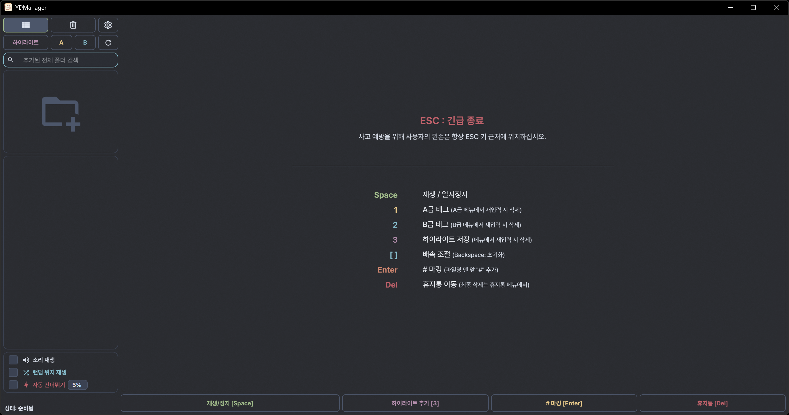

<div align="center">

<!-- 🎬 HEADER: Nord Theme Gradient Banner -->


<!-- ✨ TYPING ANIMATION -->
<a href="https://git.io/typing-svg"></a>

<br/>

<!-- 🏷️ BADGES -->
[](https://github.com/)
[](https://github.com/)
[](https://github.com/)
[](./LICENSE)

<br/>

<!-- 📌 QUOTE -->
> **"그분들의 모든 순간을, 가장 완벽하게 소장하다."**

</div>

<!-- ═══════════════════════════════════════════════════════════════════════════ -->

## 💫 About

**YDManager**는 단순한 파일 관리자가 아닙니다.  
수많은 **아이돌 직캠**과 **그녀들의 영상**을 
가장 아름답고 체계적으로 관리하기 위해 탄생한  
**동영상 관리 도구** 입니다.

<br/>

<!-- ═══════════════════════════════════════════════════════════════════════════ -->

## Installation

<div align="center">

### 📥 지금 바로 다운로드

[](https://github.com/YuanArchive/YDManager_Idol__Fan_Cam_Bias-Collection/releases/latest)

**↑ 클릭 한 번으로 설치 끝!**

</div>

<br/>

<details>
<summary>🛠️ <b>개발자용: 소스에서 실행하기</b></summary>

<br/>

```bash
# 1. 저장소 복제
git clone https://github.com/YuanArchive/YDManager_Idol__Fan_Cam_Bias-Collection.git
cd YDManager_Idol__Fan_Cam_Bias-Collection

# 2. 가상환경 생성 및 활성화
python -m venv .venv
.\.venv\Scripts\activate

# 3. 의존성 설치
pip install -r requirements.txt

# 4. 기본 점검
powershell -NoProfile -ExecutionPolicy Bypass -File .\tools\run_checks.ps1

# 5. 실행
python main.py
```

</details>

<br/>

<!-- ═══════════════════════════════════════════════════════════════════════════ -->

## Preview

<div align="center">

<!-- 🖼️ 스크린샷을 docs/screenshot_main.png로 저장하면 자동 표시됩니다 -->


</div>

<br/>

<!-- ═══════════════════════════════════════════════════════════════════════════ -->

## ✨ The YD Experience

<table>
<tr>
<td width="50%">

### 🎨 Focus on Her
Windows **Blur/Acrylic** 효과로 오직 영상에만 집중할 수 있는 환경.  
**Nord Theme** (Polar Night) 테마로 밤새 감상해도 눈이 편안합니다.

</td>
<td width="50%">

### ⚡ Keyboard-Centric
마우스는 방해될 뿐. **모든 조작을 키보드 하나로** 끝내세요.  
<kbd>1</kbd> <kbd>2</kbd> <kbd>Del</kbd> - 수천 개의 직캠을 순식간에 분류.

</td>
</tr>
<tr>
<td width="50%">

### 🛡️ Privacy Mode
**일코(Ilco) 필수템**. <kbd>Space</kbd>로 즉시 화면 숨김.  
<kbd>ESC</kbd>로 완벽한 일반인 코스프레.

</td>
<td width="50%">

### 🧠 Smart Highlights
**킬링 파트**만 박제하세요.  
나만의 '엑기스' 라이브러리를 구축하고 언제든 즉시 재생.

</td>
</tr>
</table>

<br/>

<!-- ═══════════════════════════════════════════════════════════════════════════ -->

## 🚀 Key Features

<div align="center">

| Feature | Description |
| :---: | :--- |
| 🏷️ **Rank Filters** | 영상을 **A급/B급**으로 분류하고 태그별로 모아보기 |
| ⏩ **Auto-Skip** | 빠른 탐색을 위한 **Smart Seek** 시스템 |
| 🗑️ **Safe Trash** | 자체 **휴지통 & 복구 시스템** 탑재 |
| 👁️ **16:9 Optimized** | 영상 감상에 최적화된 비율 강제 모드 |
| 🔁 **Background Indexing** | 수천 개 파일도 끊김 없이 로딩 |

</div>

<br/>

<!-- ═══════════════════════════════════════════════════════════════════════════ -->

## 🛠️ Tech Stack

<div align="center">


</div>

<br/>

<!-- ═══════════════════════════════════════════════════════════════════════════ -->

## 💻 Requirements

| 항목 | 요구 사항 |
| :--- | :--- |
| **OS** | Windows 10 / 11 (Acrylic Blur 지원) |
| **Python** | Python 3.10.x (소스 실행 및 재현 가능한 릴리스 빌드 기준) |
| **Display** | 1920×1080 이상 권장 |

> ⚠️ **Note**: macOS/Linux는 미지원 (Win32 API, BlurWindow 의존)
> 🎞️ **Codec**: 재생은 Windows/Qt Multimedia 코덱 지원에 따릅니다. 일부 HEVC/H.265 영상은 Windows HEVC 확장 설치 또는 H.264/AAC 변환이 필요할 수 있습니다.

### 데이터 및 로그 위치

| 항목 | 위치 |
| :--- | :--- |
| **앱 데이터** | `%LOCALAPPDATA%\YDManager\index` |
| **기존 데이터 마이그레이션** | 저장소의 `index/*.json` 파일은 새 위치에 파일이 없을 때만 복사됩니다. |
| **로그** | `%LOCALAPPDATA%\YDManager\logs\app.log` |
| **폰트 캐시** | `%LOCALAPPDATA%\YDManager\fonts` |

<br/>

<!-- ═══════════════════════════════════════════════════════════════════════════ -->

## ️ Keyboard Shortcuts

<details open>
<summary><b>🎮 기본 조작 (Playback)</b></summary>

<br/>

<div align="center">

| 단축키 | 동작 |
| :---: | :--- |
| <kbd>Space</kbd> | 재생 / 일시정지 |
| <kbd>←</kbd> <kbd>→</kbd> | 정밀 탐색 (뒤로/앞으로) |
| <kbd>[</kbd> <kbd>]</kbd> | 배속 조절 (0.1x 단위) |
| <kbd>Backspace</kbd> | 배속 초기화 (1.0x) |
| <kbd>↑</kbd> <kbd>↓</kbd> | 이전/다음 파일 |
| <kbd>Tab</kbd> | 포커스 순환 |

</div>

</details>

<details>
<summary><b>📁 파일 정리 (Organization)</b></summary>

<br/>

<div align="center">

| 단축키 | 기능 | 파일명 변화 |
| :---: | :--- | :--- |
| <kbd>1</kbd> | A급 태그 | `⭐ filename.mp4` |
| <kbd>2</kbd> | B급 태그 | `🔵 filename.mp4` |
| <kbd>Enter</kbd> | 해시 마킹 | `# filename.mp4` |
| <kbd>Delete</kbd> | 휴지통 이동 | - |

</div>

</details>

<details>
<summary><b>🛡️ 프라이버시 모드</b></summary>

<br/>

| 단축키 | 동작 |
| :---: | :--- |
| <kbd>Space</kbd> | 일시정지 + 화면 숨김 + 음소거 |
| <kbd>ESC</kbd> | 긴급 종료 (프로그램 즉시 닫기) |

> 💡 환경설정에서 **프라이버시 모드**를 활성화하면 작동합니다.

</details>

<details>
<summary><b>🧠 하이라이트</b></summary>

<br/>

| 단축키 | 동작 |
| :---: | :--- |
| <kbd>3</kbd> | 현재 장면 하이라이트 저장 |
| <kbd>Enter</kbd> (하이라이트 모드) | 선택한 하이라이트 재생 |
| <kbd>3</kbd> (하이라이트 모드) | 항목 삭제 |
| <kbd>Delete</kbd> (하이라이트 모드) | 하이라이트 항목 삭제 |

</details>

<details>
<summary><b>🗑️ 휴지통</b></summary>

<br/>

| 단축키 | 동작 |
| :---: | :--- |
| <kbd>R</kbd> (휴지통 모드) | 파일 복구 |
| <kbd>Enter</kbd> (휴지통 모드) | 파일 복구 |
| <kbd>Delete</kbd> (휴지통 모드) | 영구 삭제 |

</details>

<br/>

<!-- ═══════════════════════════════════════════════════════════════════════════ -->

## 📁 Project Structure

```
YDManager/
├── 📄 main.py              # 메인 진입점
├── 📁 src/
│   ├── 📁 controllers/     # 비즈니스 로직
│   ├── 📁 core/            # 이벤트 핸들러
│   ├── 📁 managers/        # 파일/플레이어/설정 관리
│   ├── 📁 ui/              # UI 컴포넌트 & 스타일
│   └── 📁 utils/           # 유틸리티 함수
├── 📁 assets/              # 아이콘 & 리소스
│   └── 📁 fonts/           # 커스텀 폰트
└── 📁 docs/                # 문서 & 스크린샷
```

<br/>

<!-- ═══════════════════════════════════════════════════════════════════════════ -->

## 📜 License

이 프로젝트는 [MIT License](./LICENSE)에 따라 배포됩니다.

<div align="center">

---

<br/>

**"Organize your chaos, Enjoy your moments."**

<br/>

*Powered by* **Antigravity** *&* **Synapse Intelligence**

<br/>

<!-- 🌊 FOOTER WAVE -->


</div>
